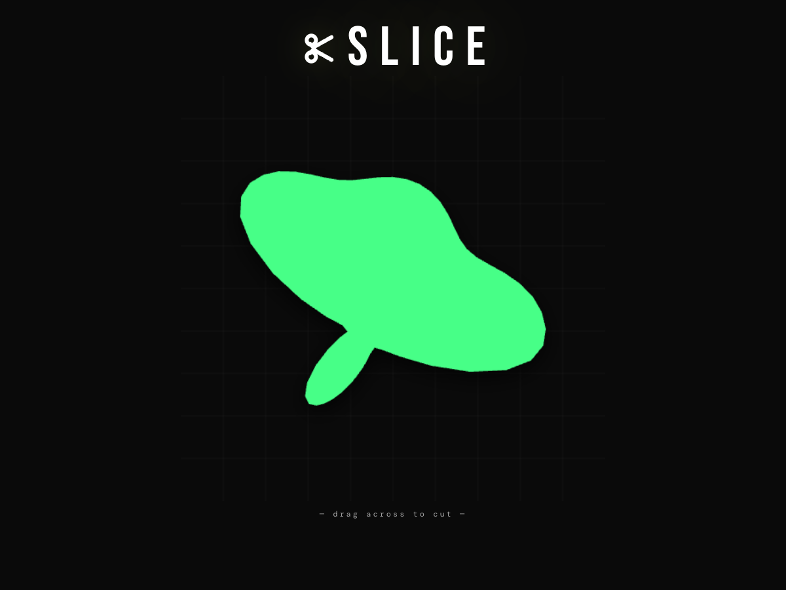
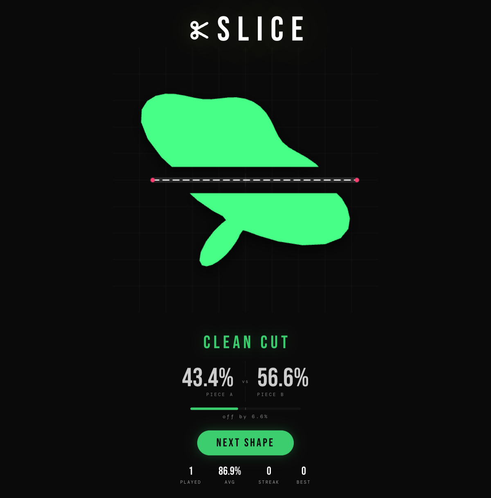

# SLICE

Browser puzzle game: **one straight cut** through a 2D polygon. The goal is to divide **total area as close to 50 / 50 as possible**. You get immediate numeric feedback, a visual split bar, graded performance labels, and persistent session stats.

---

## Screenshots

| Ready to cut | Result & stats |
| :---: | :---: |
|  |  |

---

## Core features

### Slicing & feedback

- **Pointer / touch input:** click–drag (or touch–drag) across the canvas; release to commit the cut. Drags shorter than the minimum length are ignored with a miss cue.
- **Real polygon clipping:** the cut line is applied to the actual shape geometry; invalid or non-intersecting cuts are rejected.
- **Result animation:** halves separate with motion; **particle burst** on strong scores (high accuracy band).
- **Audio:** distinct **slice** and **miss** sounds.

### Scoring & grading

- **Area balance:** displays both sides as percentages (e.g. `47.3%` vs `52.7%`) derived from the smaller area ÷ total × 100.
- **Accuracy metric:** `100 − 2 × |50 − balance|` (0–100).
- **Grade labels** (by accuracy): Perfect Slice · So Close · Clean Cut · Not Bad · Try Again.
- **Split bar:** animated fill plus a **50% marker** and an **“off by X%”** readout.

### Progression & difficulty

- **Endless rounds** with **Next Shape** to advance.
- **Adaptive level:** difficulty index scales with **round number** and **streak** so shape complexity trends harder over a good run.
- **Streak rule:** consecutive qualifying slices (accuracy **≥ 92**) extend the streak; weaker slices reset it.

### Shape content

- **Template library:** pixel-grid and path-based silhouettes (characters, objects, icons) with readable names.
- **Concave presets:** notched and bent outlines for trickier cuts.
- **Procedural blobs:** multi-lobe smoothed contours for irregular targets.
- **Per-shape styling:** color picked from a fixed palette plus alternate **fill / outline render styles**.

### Persistence & hud

- **Session stats strip** after rounds: rounds played, **running average accuracy**, current **streak**, **best streak**.
- **localStorage:** remembers **best accuracy** and **best streak** across visits.

---

## Technical stack

**React**, **TypeScript**, **Vite** — canvas 2D for rendering and interaction.
